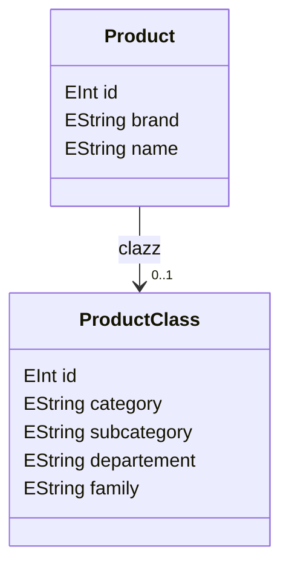
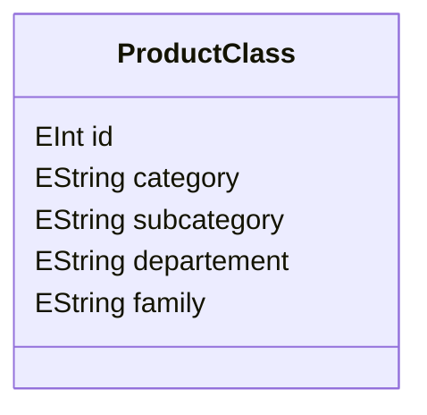
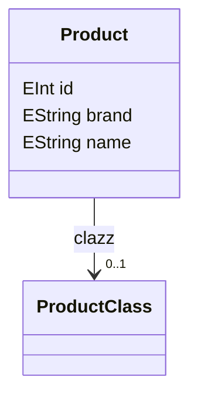

# Package: product

## Class Diagram

## Classes Overview

### Class: ProductClass

#### Description

None.

#### Class Diagram

#### Fields

| Name| Type| Bounds| Description|
| -----| ----| ------| -----------|
|id|EInt|1..1|None.|
|category|EString|0..1|None.|
|subcategory|EString|0..1|None.|
|departement|EString|0..1|None.|
|family|EString|0..1|None.|

#### References

None.

### Class: Product

#### Description

None.

#### Class Diagram

#### Fields

| Name| Type| Bounds| Description|
| -----| ----| ------| -----------|
|id|EInt|1..1|None.|
|brand|EString|0..1|None.|
|name|EString|0..1|None.|

#### References

| Name| Type| Bounds| Description|
| -----| ----| ------| -----------|
|clazz|ProductClass|0..1|None.|

## Enumerators Overview

None.
