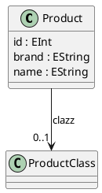

### Class: Product

#### Description

None.

#### Class Diagram

#### Fields

| Name| Type| Bounds| Description|
| -----| ----| ------| -----------|
|id|EInt|1..1|None.|
|brand|EString|0..1|None.|
|name|EString|0..1|None.|

#### References

| Name| Type| Bounds| Description|
| -----| ----| ------| -----------|
|clazz|ProductClass|0..1|None.|

