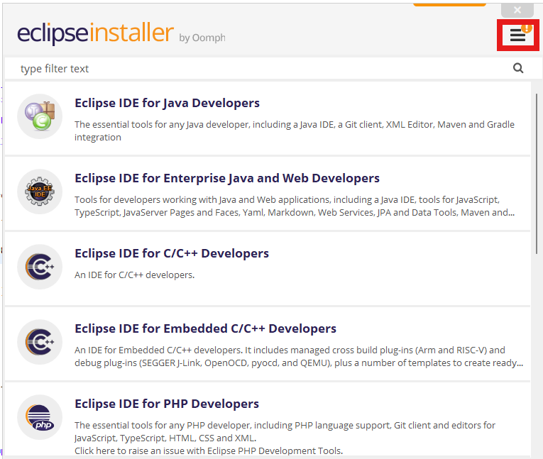
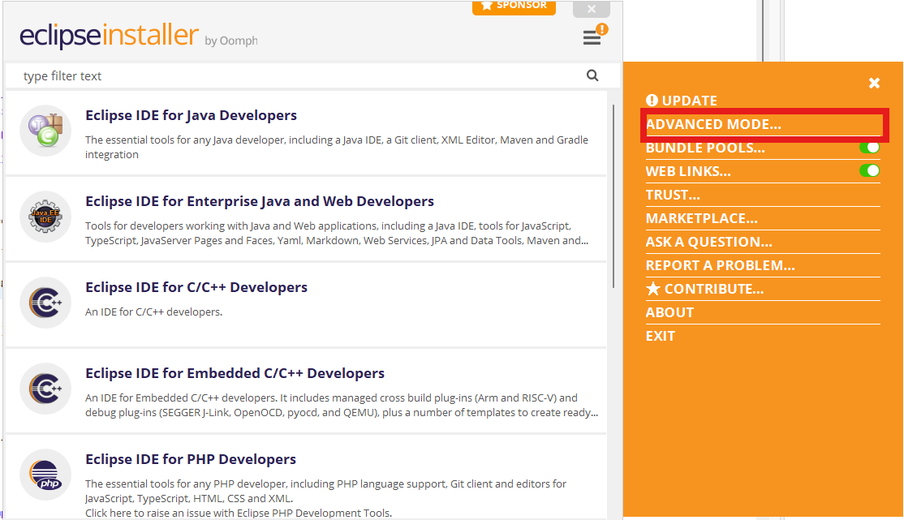
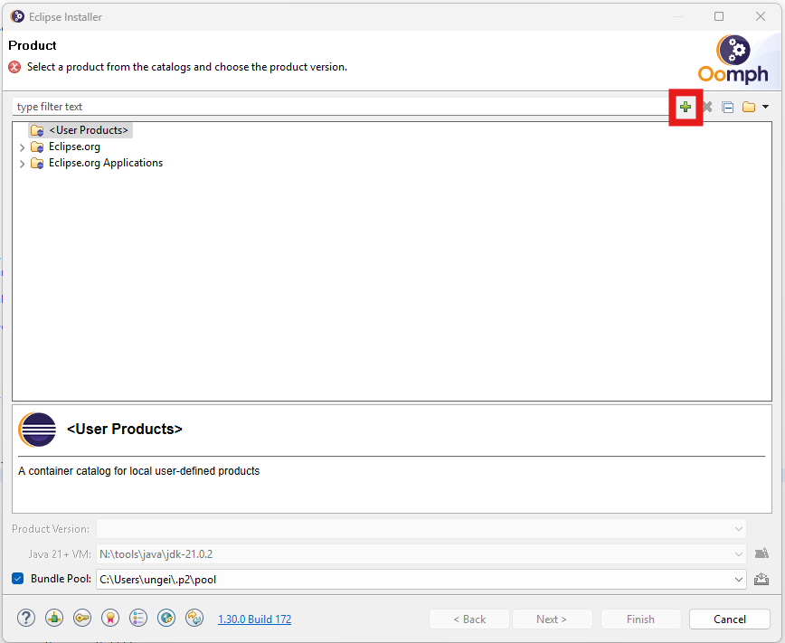
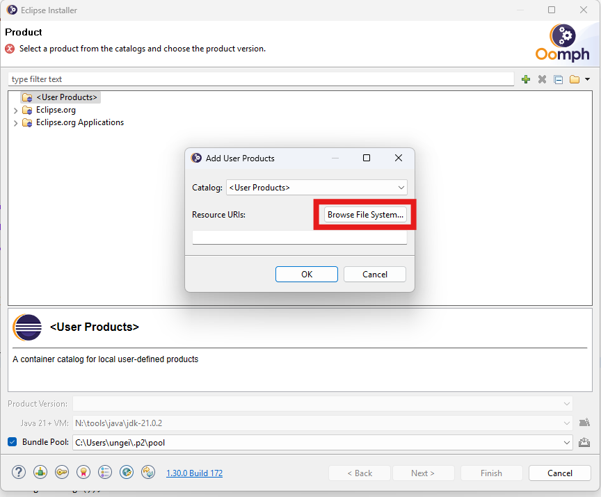
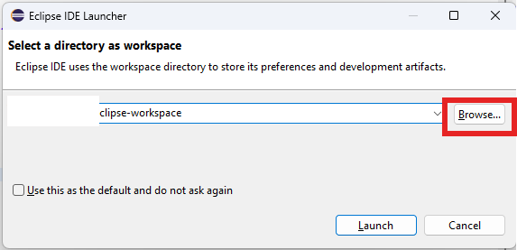
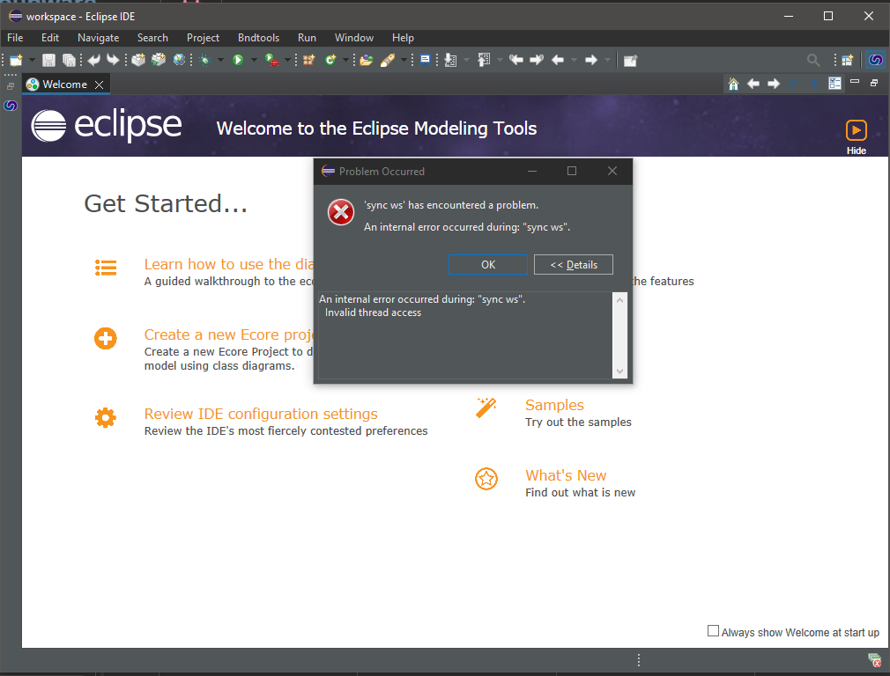
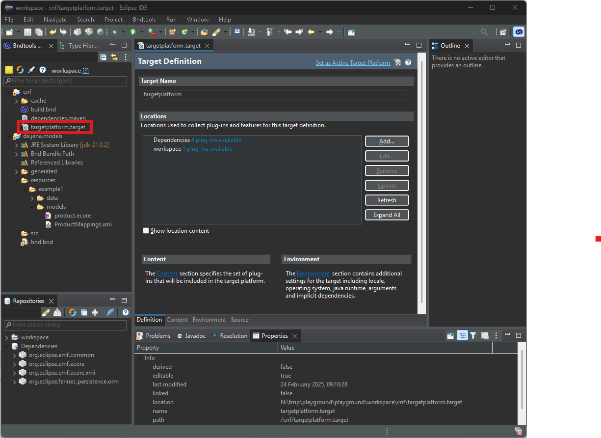
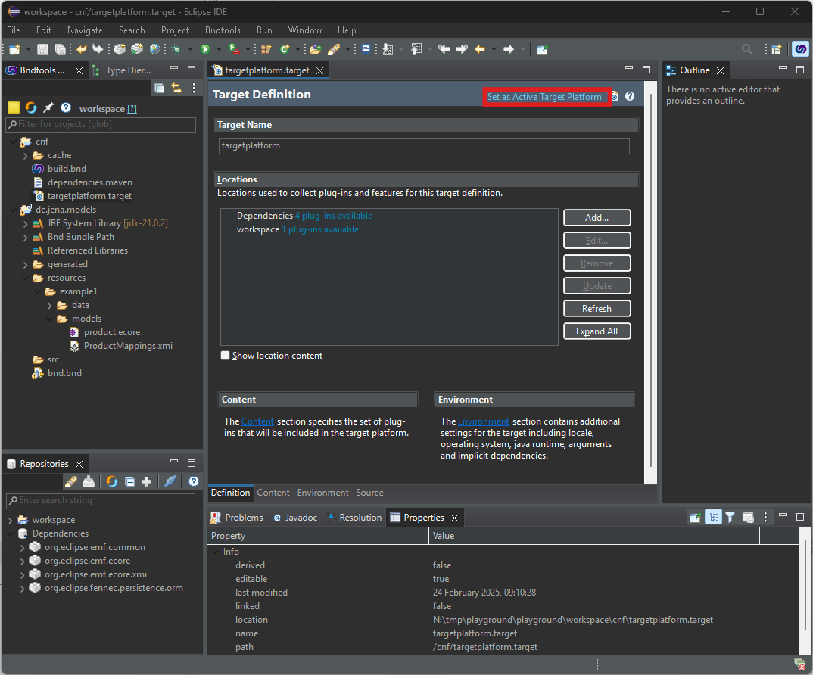

# MDO Playground App

# Installation

[Zip](https://devel.data-in-motion.biz/jenkins/view/Jena/job/de.jena/job/MDO/job/main/lastSuccessfulBuild/artifact/de.jena.mdo.playground.app/generated/distributions/executable/playground.zip) herunterladen und in einen bliebigen Ordner entpacken.

## Installation der IDE und Vorbereitung des Workspace

Im entpackten Ordner befindet sich ein weiterer Ordner `eclipse`. Hier die url anklicken und den Eclipse installer herunterladen und ausführen.

### Konfiguration Eclipse Installer

1. Installer in den Advanced mode versetzen
2. 
3. 
4. Den Anweisungen zur Installation des Installers folgen.
5. Auf das kleine `+`klicken 
6. Brows File System wählen und `<Installationsordner der App>\eclipse\MDP-Playground.setup` auswählen.
7. MDO PlaygroundIDE auswählen und `next` bzw. `weiter` anklicken.
8. Den Screen Projects bzw. Projekte mit `next` bzw. `weiter` überspringen.
9. Beliebigen `root install folder` auswählen und mit `next` bzw. `weiter` zum nächsten Screen springen.
10. Installation mit finish starten.
11. Die IDE sollte automatisch starten, alterantiv zum gewählten Installationsordner navigieren und die eclipse.exe starten.
12.  
Beim ersten Start der IDE fragt Eclipse nach einem Workspace. Hier zu <Installationsordner der App>\workspace` navigieren. 
13. 
Nach dem Start den Welcome Screen mit dem x am Tab oben links schließen. (Falls der nachfolgende Fehler screen zu sehen ist, kann der mit ok bestätigt und ignoriert werden). 
14.  
Im cnf Projekt die Datei `targetplattform.target` öffnen.
15.
 `Set as Active Target Platform` anklicken. Der link in dem Editor ändert sich damit zu `Reload Target Platform`. 
16. Anschließend im Projekt `de.jena.models` `resources\example1\models\ProductMappings.xmi` öffnen und überprüfen, das keine Fehlermeldung angezeigt wird. 

# Start der App

Im Windows Explorer zum entpackten Ordner navigieren und auf `start.bat` klicken.

## Test ob die App korrekt gestartet ist

Im Browser http://localhost:8088/mdo/playground/rest/product/Product?mediaType=application/json aufrufen und überprüfen ob json Daten zurück kommen.

# Updates für zukünftige Versionen und verlegen des Workspace
Im Fall das eine neue Version der App verfügbar ist, kann die aktuellste Version immer https://devel.data-in-motion.biz/jenkins/view/Jena/job/de.jena/job/MDO/job/main/lastSuccessfulBuild/artifact/de.jena.mdo.playground.app/generated/distributions/executable/playground.zip hier heruntergeladen werden. 

## Verlegen des workspace Ordners
Aktuell liegt  der Arbeitsbereich (workspace) der App exemplarisch mit in dem ZIP. Auf dauer, ist es wahrscheinlich sinnvoll den Workspace auf einen externen Ordner zu verlegen, der neuinstallationen übersteht. Hierzu mit einem Texteditor die Datei `launcher.properties` öffnen und das property `de.jena.mdo.playground.workspace=` auf einen beliebigen Ordner verlegen. 

# Workspace aufbau

Alle Modelle und Daten müssen im Ordner resources liegen. Eine Beispielstruktur ist dann:
```
resources
	\-example1
		\-data
			\-BeispielSchemaName
				\-test.csv
			\-PRODUCT.csv
        \-models
        	\-test.ecore
        	\-EntityMappingFürExample1.xmi
	\-example2
		\-data
			\-BeispielSchemaName
				\-test.csv
			\-PRODUCT.csv
        \-models
        	\-AnderesModel.ecore
        	\-EntityMappingFürExample2.xmi			
```

Die erste Ebene unter resources stellt hier immer eine JPA PersitanceUnit dar. 
**data** enthällt eine Reihe von CSV Datein. Der Name der CSV Dateien entspricht ihren späteren Tabellen namen. Ordner eine Ebene unter `data` repräsentieren daten die mit einem Schema entsprechend dem Ordernamen in die Datenbank importiert werden.

**models** enthällt ecore modelle und das zugehörige XMI mit der Mapping beschreibung für die `PersistenceUnit`. 

## Entitiy Mappings und was zu beachten ist.

Jede Persitence Unit bekommt eine eigene Datenbank mit den daten aus dem `data` Ordner. Modelle in den Ecore dateien haben keine direkte zuordnung zu der `PersistenceUnit` und können auch auf sich untereinander verweisen. Die zuordnung zu einer `PersistenceUnit` erfolgt darüber, dass ein EntityMapping in der xmi Datei den Namen des `PersistenceUnit` Ordners hat. 

Das heißt, dass die Ordnerstruktur hauptsächlich eine zuordnung der Daten zu ihren Datenbanken bindet und Modelle und EnittyMappings lediglich der besseren Ordnung wegen in dem jeweiligen `PersistenceUnit` Ordner liegen. Der Ordner `example1/models` kann auch modelle und Mappings für andere Units enthalten, wenn das EntityMapping den entsprechenden namen hat.

**!! Mehrere EntityMappings z.B. mit dem Namen example1 können unvorhergesehen Effekte haben und werden aktuell vom System nicht abgefangen!!**

## Entitiy Mappings erstellen.

Die App hat eine Konsole auf der Kommandos ausgeführt werden können. Eines davon erlaubt es für ein Modell, ein EntityMapping generieren zu lassen. Das heißt, wenn es im Ecore eine EClass mit dem namen `PRODUCT` gibt, geht der generator davon aus, dass es auch eine Tabelle mit Namen `PRODUCT` gibt. Ein Attritubt mit Namen `TEst` vom Typ String, dann ein eine Spalte mit namen `TEst` vom Typ VARCHAR usw. 

Beispiel:

```
g! help createMapping
createMapping - Creates a  JPA mapping from the given ecore file. The mapping will be stored next to the ecore file.
Usage: createMapping <ecoreFileLocation> <persistanceUnitName>
   scope: mdo
   parameters:
      String   the location of the ecore file. Can be absolut or relative to the configured data folder
      String   the name of the persitence unit. Will become the name of the file with the mapping as well.

g! createMapping example1/models/product.ecore test.xmi
```

Das Kommando ließt das Package das es in dem `product.ecore` findet und schreibt eine kompatibles Mapping in die Datei `test.xmi`, welche direkt neben dem `product.ecore` erscheint.

**!!! Pfade immer mit `/` unterteilen. Der Windows `\` sorgt überlicherweise für Probleme.** 

# FAQ

## Nach dem neustart von Eclipse zeigt mir der xmi Editor einen Fehler das er irgendwas nicht finden kann.
Eclipse ist bei einem Neustart manchmal zu schnell den Editor zu öffnen und hat externe Modelle noch nicht geladen. Lösung: Editor Tab schließen, targetplatform.target öffnen und auf `Reload Target Platform` oben rechts klicken und xmi file anschließend wieder öffnen.

