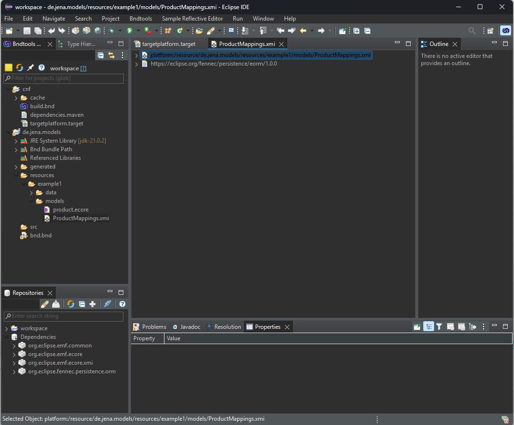

# MDO Playground App

# Intallation

[Zip](https://devel.data-in-motion.biz/jenkins/view/Jena/job/de.jena/job/MDO/job/main/lastSuccessfulBuild/artifact/de.jena.mdo.playground.app/generated/distributions/executable/playground.zip) herunterladen und in einen bleibigen Ordner entpacken.

## Installation der IDE und Vorbereitung des Workspace

Im entpackten Ordner befindet sich ein weiterer Ordner `eclipse`. Hier die url anklicken und den Eclipse installer herunterladen und ausführen.

### Konfiguration Eclipse Installer

1. Installer in den Advanced mode versetzen
2. 
3. 
4. Den Anweisungen zur Installation des Installers folgen.
5. Auf das kleine `+`klicken 
6. Brows File System wählen und `<Installationsordner der App>\eclipse\MDP-Playground.setup` auswählen.
7. MDO PlaygroundIDE auswählen und `next` bzw. `weiter` anklicken.
8. Den Screen Projects bzw. Projekte mit `next` bzw. `weiter` überspringen.
9. Beliebigen `root install folder` auswählen und mit `next` bzw. `weiter` zum nächsten Screen springen.
10. Installation mit finish starten.
11. Die IDE sollte automatisch starten, alterantiv zum gewählten Installationsordner navigieren und die eclipse.exe starten.
12. Beim ersten Start der IDE fragt Eclipse nach einem Workspace. Hier zu <Installationsordner der App>\workspace` navigieren. 
13. Nach dem Start den Welcome Screen mit dem x am Tab oben links schließen.
14. Im cnf Projekt die Datei `targetplattform.target` öffnen. 
15. `Set as Active Target Platform` anklicken. Der link in dem Editor ändert sich damit zu `Reload Target Platform`. 
16. Anschließend im Projekt `de.jena.models` `resources\example1\models\ProductMappings.xmi` öffnen und überprüfen, das keine Fehlermeldung angezeigt wird. 

# Start der App

Im Windows Explorer zum entpackten Ordner navigieren und auf `launch.bat` klicken.

